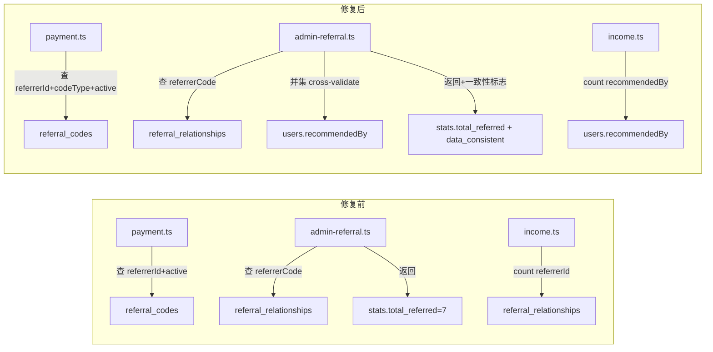

## 缺陷概述

推荐码系统存在两个互相关联的缺陷，根源均为多表推荐关系未同步且查询条件过宽：

### 缺陷 1：支付升级后不生成 LCRG 推荐码

- 用户靖鸿（GYRGJH7H, ID=113）支付 399 元升级联创推荐官后，未生成 LCRG 前缀推荐码
- 根因：`payment.ts` notify handler 第 415 行查询 `referral_codes` 时仅按 `referrerId+status='active'` 过滤，不区分 `codeType`。靖鸿已有的 `GYRGEP1W`（codeType=public_welfare）被命中，导致跳过 LCRG 码（codeType=creator）的生成

### 缺陷 2：管理后台与小程序推荐人数统计不一致

- 岚姐（LCRGOE50, ID=7）管理后台 insight 显示推荐 7 人，但实际推荐 0 人
- 根因：`admin-referral.ts` insight API 仅查 `referral_relationships` 表计数，未交叉验证 `users.recommendedBy`；`income.ts` stats 亦同
- 7 个被推荐用户的 `users.recommendedBy` 被批量脚本错误覆写为 43（openid=NULL 占位账号），应为 7

### 数据损坏范围

跨表不一致共 9 条，**全部为 openid=NULL 的占位账号**：

- LCRGOE50（岚姐 ID=7）：7 用户 `recommendedBy` 误为 43，应为 7
- LCRG1BN1（referrerId=62）：2 用户 `recommendedBy` 误为 50，应为 62

## 核心目标

1. 修复代码缺陷，阻止未来同类问题
2. 修正 9 条历史数据不一致
3. 确保不损坏任何真实用户的推荐关系树

## 技术栈

- 后端：TypeScript + Express.js + Prisma + MySQL
- 生产服务器：ubuntu@175.24.227.251
- 编译：tsc → dist/ → PM2 运行
- 数据库：MySQL renrenmeihao

## 修复策略

### 代码修复（3 个文件）

**A. payment.ts（第 415 行）- 增加 codeType 过滤**
现有代码仅按 `referrerId + status='active'` 查询已存在推荐码，导致不同 codeType 的码互相阻塞。修复：根据 `newRole` 映射出期望的 `codeType`，加入查询条件，允许同一用户持有 public_welfare 和 creator 两种类型的推荐码。

**B. admin-referral.ts（第 483-530 行）- insight API 交叉验证**
现有代码 `total_referred = relationships.length` 仅统计 `referral_relationships` 表。修复：改为 `referral_relationships` 与 `users WHERE recommendedBy = referrerId` 的并集去重，并新增 `data_consistent` 标志位标记两条数据源是否一致。

**C. income.ts（第 91-105 行）- stats 统一数据源**
现有代码 `referral_relationships.count({referrerId})` 作为 memberCount。修复：改为 `users.count({recommendedBy: userId})`，与管理后台 insight 和小程序端保持一致口径。

### 数据修复（2 项操作，均仅涉及 openid=NULL 占位账号）

**D. 靖鸿 LCRG 码补建**
在 `referral_codes` 表中插入一条新记录：codeType=creator, LCRG 前缀随机码, referrerId=113, status=active

**E. 9 条 recommendedBy 修正**

```sql
UPDATE users SET recommendedBy = 7 WHERE id IN (41,42,44,46,47,49,52);
UPDATE users SET recommendedBy = 62 WHERE id IN (48,51);
```

## 架构变更



## 风险控制

| 风险 | 缓解措施 |
| --- | --- |
| 修复过程中断现有服务 | 先备份数据库，代码修复后统一编译部署 |
| 数据修复影响真实用户 | 仅修复 openid=NULL 的占位账号，条件精确到 ID 白名单 |
| payment.ts 改动影响其他升级路径 | codeType 过滤仅在 `partner_upgrade` 等已知付费类型时生效，不影响 member/membership 等类型 |
| 编译失败导致服务不可用 | 部署前本地验证语法正确性，PM2 支持快速回滚 |


## Agent Extensions

### SubAgent

- **code-explorer**
- Purpose: 在实施代码修复前，再次确认 payment.ts、admin-referral.ts、income.ts 三个文件的精确行号和上下文，确保编辑位置准确无误
- Expected outcome: 提供每个文件的精确编辑位置（行号范围）、现有代码片段、以及修改后的完整代码块

### MCP

- **filesystem**
- Purpose: 读取生产服务器上的 TypeScript 源文件（/home/ubuntu/renrenmeihao-api/src/routes/）以确认当前代码版本；在修复后验证文件已正确写入
- Expected outcome: 确认源代码读取准确，编辑后内容无误