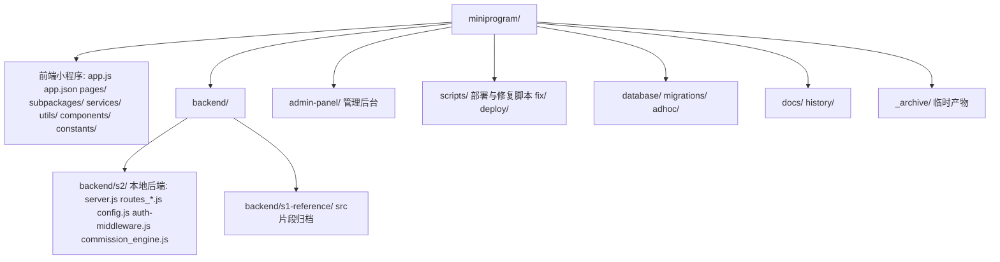

## 需求概述

针对《技术栈与目录结构分析》第五节列出的 5 项主要风险，给出可落地、不破坏现有功能的修复方案，并分阶段执行。

## 核心修复内容

- **风险2（仓库混杂/技术债）**：将根目录堆积的临时脚本、库文件、散落 SQL、部署脚本、过程性文档归档到 `scripts/`、`database/adhoc/`、`docs/history/`、`_archive/`，并完善 `.gitignore`；运行态文件（server.js、routes_*.js、config.js、auth-middleware.js、commission_engine.js）本轮先不移动，留待独立归位阶段。
- **风险3（主包/分包页面重复）**：`pages/` 下存在与 `subpackages/` 同构的重复目录（matchmaker/chat/salon/group/reunion/cooperation/franchisee/community-station/recommender/user/payment/verify/activity/partner-apply 等）。先全仓扫描导航引用，无引用则删除 orphan 目录，有引用则改写导航路径到分包对应页，再以开发者工具构建校验。
- **风险2-后端归位**：用 git mv 将 server.js + 全部 routes_*.js + config.js + auth-middleware.js + commission_engine.js 移入 `backend/s2/`，重写 server.js 内约 40 处 require 路径及路由间相互引用，做 Node 加载冒烟测试，失败即回退。
- **风险1（S1 源码未纳管）**：本地 `src/` 两个 TS 片段归档到 `backend/s1-reference/`；生产 S1 完整源码因本环境无 SSH 访问权限，仅输出"服务器打包→下载→提交"的手动执行清单，不自动改写生产运行态。
- **风险4+5（导出规范化/依赖版本）**：统一 `services/api.js` 导出为双兼容（保留 `.default` 与 `.API`），在根 `README.md` 增补版本基线表，不升级大版本以免破坏构建。

## 质量约束

- 任何移动/重命名后必须同步修正所有引用（app.json 注册、require 路径、构建脚本），并做引用扫描 + 语法/加载校验。
- 每阶段独立可回退（git），优先改动低风险的静态文件，高风险改动（后端归位）置于带冒烟测试门的单独阶段。

## 技术栈与约束

- 前端：微信原生小程序（WXML/WXSS/JS），后端：Node + Express 5 + better-sqlite3（本地 S2）、TypeScript + Prisma + MySQL（生产 S1）；管理后台 React 18 + AntD 5 + CRA。
- 既有约定：所有 API 路径集中在 `services/api.js`；移动文件后页面导航与 require 路径必须同步；生产同步仅由用户单独确认时执行。

## 实施策略

1. **先清理静态技术债（零风险）**：临时文件（`_verify_*.mjs/.png`、`tmp_fix_server.js`、`patch_*.js`、`check_*.js`、`create_tables.js`）与本地库文件（`renrenmei.db`、`*_backup_*.db` 等）直接加入 `.gitignore` 不提交；一次性脚本（`fix_*.py`、`update_*.py`、`deploy_*.py`、`*.sh`、一次性 `*.js`）归入 `scripts/`；散落 `*.sql` 归入 `database/adhoc/`；过程性 `.md`（含"报告/总结/审计/分析/调查/记录/计划"命名）归入 `docs/history/`。运行态后端文件本轮不动。
2. **页面去重（中风险）**：全仓 grep `navigateTo/redirectTo/switchTab/reLaunch` 目标是否含 `/pages/<dup>/`；无引用直接删 orphan 目录，有引用先改写为 `subpackages/<pkg>/pages/<dup>/` 再删；最终以开发者工具"构建 npm + 代码依赖分析"校验主包/分包无断链。
3. **后端 S2 归位（高风险，带门禁）**：git mv 整体平移，重写 server.js 约 40 处 `require('./routes_*')` → `require('./backend/s2/routes_*')` 及 `./auth-middleware`、`./config`、`./commission_engine`、`./utils/logger`；同时修正路由文件间相互 require；运行 `node -e "require('./server.js')"` 冒烟（或加载全部路由模块）确认无抛错，失败则 `git checkout` 回退。
4. **S1 回纳（手动，不自动）**：本地 `src/` 片段归档；输出服务器 `tar` 打包→`scp` 下载→提交 `backend/s1/` 的清单，供用户在有 SSH 环境时执行。
5. **规范化（低风险）**：`services/api.js` 维持 `module.exports = { default: API, API }` 双兼容；根 `README.md` 增补版本基线。

## 实施要点

- 引用扫描使用 ripgrep 全仓比对，避免漏改；移动后逐阶段验证再进入下一阶段。
- 后端归位阶段保留"冒烟测试不通过即回退"，确保 `node server.js` 仍能监听 3000。
- 不触碰生产服务器运行态，S1 仅出清单。

## 架构设计（目标目录）



## 目录结构（将创建/修改）

```
miniprogram/
├── backend/                         # [NEW] 后端归位根目录
│   ├── s2/                         # [NEW] 本地后端 S2：git mv server.js + routes_*.js + config.js + auth-middleware.js + commission_engine.js
│   └── s1-reference/               # [NEW] 原 src/ 两个 TS 片段归档
├── scripts/                        # [NEW] 运维脚本归档（fix_*.py/update_*.py/deploy_*.py/*.sh 平移）
├── database/adhoc/                 # [NEW] 散落根目录 *.sql 平移
├── docs/history/                   # [NEW] 过程性 .md 平移
├── _archive/                       # [NEW] 临时产物（_verify_*.mjs/.png、tmp_*.js、patch_*.js、check_*.js）
├── .gitignore                      # [MODIFY] 追加 renrenmei*.db、*_backup_*.db、node_modules、_archive/
├── services/api.js                 # [MODIFY] 统一导出 default+API 双兼容
├── README.md                       # [MODIFY] 增补版本基线表与目录说明
├── app.json                        # [MODIFY] 删除 orphan 页面注册（如有）
├── pages/                          # [MODIFY] 删除确认无引用的重复目录
└── server.js                       # [MODIFY] 后端归位阶段重写 require 路径
```

## Agent Extensions

### SubAgent

- **code-explorer**
- Purpose: 在页面去重与后端归位阶段，全仓扫描导航目标 `/pages/<dup>/` 引用、路由文件间相互 require 路径，输出需改写/删除的精确清单
- Expected outcome: 得到完整的引用关系图，确保删除或移动文件前无遗漏引用，避免破坏现有功能

### Skill

- **miniprogram-development**
- Purpose: 在前端页面去重完成后，执行微信开发者工具的构建/依赖分析校验，确认主包与分包无断链、编译通过
- Expected outcome: 验证页面删除与导航改写后小程序仍可正常编译与预览，功能完整

### MCP

- **filesystem**
- Purpose: 执行 git mv 等文件移动/编辑（move_file/edit_file/write_file），对根目录技术债文件进行归档归位
- Expected outcome: 完成临时脚本、散落 SQL、过程文档的精准移动与 .gitignore 更新，保留可追溯历史