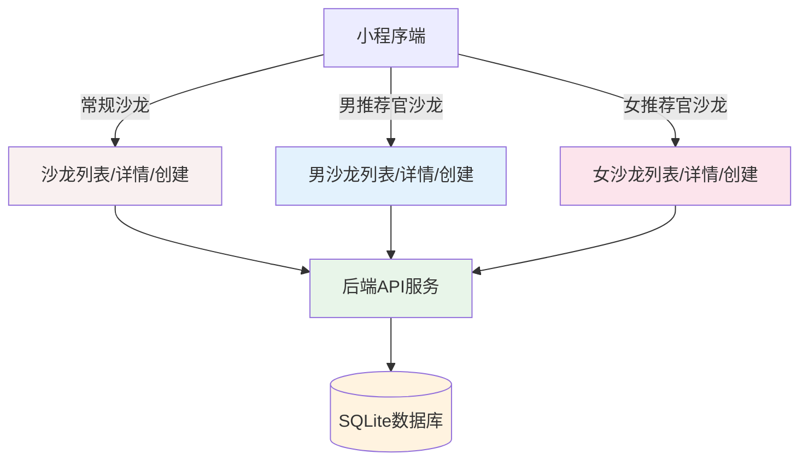

## 产品概述

为"人人媒好"相亲小程序创建完全独立的男推荐官沙龙和女推荐官沙龙功能模块，与现有常规沙龙（相亲交友定位）实现完全隔离。新模块定位为"商务对接、人脉拓展、资源合作"，创建独立路由、独立页面、独立数据结构、独立权限体系。

## 核心功能

### 一、列表页（独立页面）

1. **视觉与文案**：商务简约风格，头部标题明确标注「男推荐官沙龙」/「女推荐官沙龙」，禁用相亲类标签与文案
2. **活动卡片**：

- 席位展示：推荐官席位上限9人，图形化展示已占/剩余席位
- 人数标注：全场上限27人，统一备注「含随行人员」
- 移除常规沙龙男女分组的相亲式布局

3. **权限按钮**：页面悬浮「申请发布沙龙」按钮，仅认证推荐官可见，非推荐官自动隐藏
4. **状态展示**：区分正常可报名、名额已满、审核中三种状态，样式沿用项目规范

### 二、详情页（独立页面）

1. **视觉主题**：男推荐官采用蓝色商务风，女推荐官采用粉色商务风，整体版式大气简约
2. **席位模块**：分两块可视化展示——推荐官席位占用、全场总人数进度（上限27人）
3. **报名功能**：

- 报名弹窗支持填写本人信息 + 随行人员信息，随行最多添加2人
- 强制人数校验：已报名人数+本次报名人数 ≤27，超限禁止提交并弹出提示

4. **操作按钮（动态渲染）**：

- 普通用户：立即报名、取消报名
- 沙龙创建人（推荐官）：管理沙龙、编辑、下架等商务运营类按钮

5. **内容规范**：页面所有介绍文案、提示语围绕「商务对接、人脉合作」设计，不得出现相亲、交友相关内容

### 三、创建页（独立页面）

1. **类型限制**：由对应入口进入后，自动锁定沙龙性别类型，页面内禁止手动修改
2. **表单字段 & 引导**：

- 封面图、活动标题、活动时间、活动地点、人数上限、活动费用、活动描述
- 表单提示文案引导填写商务合作、行业交流相关内容

3. **人数规则**：人数上限默认27人，可自定义调整，上限不超过27人
4. **审核流程**：

- 表单提交 → 状态变更为「审核中」
- 后台人工审核：通过则正常上线开放报名；驳回则返回编辑并展示驳回原因
- 审核中的沙龙：列表可见，但禁止用户报名

### 四、数据&接口要求

1. 数据库新增字段：salon_type（区分三种沙龙）、audit_status（审核状态）、reject_reason（驳回原因）
2. 后端API新增：推荐官沙龙专属列表接口、详情接口、创建接口、审核接口
3. 前端页面完全独立，不复用常规沙龙的wxml/wxss/js文件

### 五、权限体系

1. 仅认证推荐官可发布沙龙（联创推荐官、社区服务站、城市合伙人、专业推荐官）
2. 公益推荐官无申办权限，仅可报名参会
3. 男推荐官沙龙仅男士可报名，女推荐官沙龙仅女士可报名

## 技术栈选择

- **前端框架**：微信小程序原生开发（WXML + WXSS + JS + JSON）
- **后端框架**：Node.js + Express 5.2.1
- **数据库**：SQLite 3.x (better-sqlite3)
- **认证方式**：JWT (jsonwebtoken)
- **文件上传**：微信小程序 wx.uploadFile API

## 实施方法

### 策略：完全独立的页面架构

创建完全独立的页面文件，而不是通过参数区分。这样可以确保数据隔离、样式隔离、权限隔离。

### 关键决策

1. **为何创建独立页面而非参数区分？**

- 用户要求"完全独立"，包括路由、页面、数据、权限全部隔离
- 独立页面便于维护，避免逻辑耦合
- 业务定位完全不同（商务对接 vs 相亲交友），代码复用价值低
- 独立页面可以实现真正的权限隔离和数据隔离

2. **如何保证与常规沙龙的代码隔离？**

- 创建独立的页面文件：`male-salon-list`、`female-salon-list`、`male-salon-detail`、`female-salon-detail`、`male-salon-create`、`female-salon-create`
- 数据库使用同一张表，但通过 `salon_type` 字段区分
- 后端API使用同一套接口，但通过 `salon_type` 参数过滤

3. **如何实现人数校验（≤27人）？**

- 前端：报名提交前校验已报名人数+本次报名人数（本人+随行）≤27
- 后端：数据库事务中校验，防止并发超标
- 随行人员最多2人，存储在 `companions_json` 字段

### 需要新建/修改的文件

| 文件 | 操作 | 说明 |
| --- | --- | --- |
| `subpackages/activity/pages/male-salon-list/*` | 新建 | 男推荐官沙龙列表页（4个文件） |
| `subpackages/activity/pages/female-salon-list/*` | 新建 | 女推荐官沙龙列表页（4个文件） |
| `subpackages/activity/pages/male-salon-detail/*` | 新建 | 男推荐官沙龙详情页（4个文件） |
| `subpackages/activity/pages/female-salon-detail/*` | 新建 | 女推荐官沙龙详情页（4个文件） |
| `subpackages/activity/pages/male-salon-create/*` | 新建 | 男推荐官沙龙创建页（4个文件） |
| `subpackages/activity/pages/female-salon-create/*` | 新建 | 女推荐官沙龙创建页（4个文件） |
| `server.js` 或 `routes_salon.js` | 修改 | 补充推荐官沙龙专属API逻辑 |
| `utils/salon-config.js` | 修改 | 补充独立页面的路由配置 |
| `app.json` 或 `subpackages/activity/pages.json` | 修改 | 注册新页面路由 |


## 实施笔记

### 性能考虑

- 独立页面会增加小程序包大小，但仍在可接受范围内（每个页面约10-20KB）
- 数据库查询通过 `salon_type` 索引优化
- 列表页使用分页加载，避免一次性加载过多数据

### 日志记录

- 前端：使用 `console.log` 记录关键操作（报名、创建、审核）
- 后端：使用 `logger` 记录API请求和错误
- 审核操作记录到数据库 `audit_logs` 表（如需）

### 爆炸半径控制

- 只新建文件，不修改现有常规沙龙的代码
- 数据库表结构兼容，新增字段不影响现有数据
- 后端API兼容，新增逻辑不影响现有接口

## 架构设计

### 系统架构图



### 数据流

1. 用户点击「男推荐官沙龙」入口
2. 跳转到 `male-salon-list` 页面
3. 页面加载时请求后端API：`GET /v1/salons?salon_type=male_salon`
4. 后端返回该类型的沙龙列表
5. 用户点击某个沙龙，跳转到 `male-salon-detail` 页面
6. 用户点击「立即报名」，弹出报名弹窗
7. 填写本人信息 + 随行人员信息（最多2人）
8. 提交报名：`POST /v1/salons/:id/register`
9. 后端校验人数是否≤27，校验通过则创建报名记录

## 目录结构

### 新建文件清单

```
男女推荐官沙龙独立页面 - 文件清单

miniprogram/
├── subpackages/
│   └── activity/
│       └── pages/
│           ├── male-salon-list/              [NEW] 男推荐官沙龙列表页
│           │   ├── male-salon-list.js        [NEW] 列表页逻辑
│           │   ├── male-salon-list.json      [NEW] 页面配置
│           │   ├── male-salon-list.wxml     [NEW] 列表页结构
│           │   └── male-salon-list.wxss     [NEW] 列表页样式（蓝色商务风）
│           │
│           ├── female-salon-list/            [NEW] 女推荐官沙龙列表页
│           │   ├── female-salon-list.js      [NEW] 列表页逻辑
│           │   ├── female-salon-list.json    [NEW] 页面配置
│           │   ├── female-salon-list.wxml   [NEW] 列表页结构
│           │   └── female-salon-list.wxss   [NEW] 列表页样式（粉色商务风）
│           │
│           ├── male-salon-detail/           [NEW] 男推荐官沙龙详情页
│           │   ├── male-salon-detail.js      [NEW] 详情页逻辑
│           │   ├── male-salon-detail.json    [NEW] 页面配置
│           │   ├── male-salon-detail.wxml   [NEW] 详情页结构
│           │   └── male-salon-detail.wxss   [NEW] 详情页样式（蓝色商务风）
│           │
│           ├── female-salon-detail/         [NEW] 女推荐官沙龙详情页
│           │   ├── female-salon-detail.js    [NEW] 详情页逻辑
│           │   ├── female-salon-detail.json  [NEW] 页面配置
│           │   ├── female-salon-detail.wxml [NEW] 详情页结构
│           │   └── female-salon-detail.wxss [NEW] 详情页样式（粉色商务风）
│           │
│           ├── male-salon-create/           [NEW] 男推荐官沙龙创建页
│           │   ├── male-salon-create.js      [NEW] 创建页逻辑
│           │   ├── male-salon-create.json    [NEW] 页面配置
│           │   ├── male-salon-create.wxml   [NEW] 创建页结构
│           │   └── male-salon-create.wxss   [NEW] 创建页样式（蓝色商务风）
│           │
│           └── female-salon-create/         [NEW] 女推荐官沙龙创建页
│               ├── female-salon-create.js    [NEW] 创建页逻辑
│               ├── female-salon-create.json  [NEW] 页面配置
│               ├── female-salon-create.wxml [NEW] 创建页结构
│               └── female-salon-create.wxss [NEW] 创建页样式（粉色商务风）
│
├── server.js                                [MODIFY] 补充推荐官沙龙API逻辑
├── routes_salon.js                          [MODIFY] 补充推荐官沙龙路由
├── utils/
│   └── salon-config.js                     [MODIFY] 补充独立页面路由配置
│
└── subpackages/
    └── activity/
        └── pages.json                      [MODIFY] 注册新页面路由
```

### 文件详细说明

1. **male-salon-list.js** [NEW]

- 用途：男推荐官沙龙列表页逻辑
- 功能：加载沙龙列表、分页加载、状态筛选、权限判断（仅推荐官可见发布按钮）
- 实现要求：商务简约风格，移除相亲类标签，推荐官席位图形化展示

2. **male-salon-list.wxml** [NEW]

- 用途：男推荐官沙龙列表页结构
- 功能：头部标题、活动卡片（推荐官席位9人、全场27人）、悬浮发布按钮
- 实现要求：明确标注「男推荐官沙龙」，禁用相亲类文案

3. **male-salon-list.wxss** [NEW]

- 用途：男推荐官沙龙列表页样式
- 功能：蓝色商务风主题、卡片样式、席位可视化
- 实现要求：主色调 `#1565C0`，渐变 `linear-gradient(135deg, #1565C0, #42A5F5)`

4. **male-salon-detail.js** [NEW]

- 用途：男推荐官沙龙详情页逻辑
- 功能：加载详情、席位展示、报名弹窗、人数校验（≤27人）、动态渲染操作按钮
- 实现要求：商务对接文案，禁止相亲/交友关键词

5. **male-salon-detail.wxml** [NEW]

- 用途：男推荐官沙龙详情页结构
- 功能：封面图、席位模块（推荐官席位+全场人数）、报名表单、底部操作栏
- 实现要求：蓝色商务风，随行人员最多2人

6. **male-salon-detail.wxss** [NEW]

- 用途：男推荐官沙龙详情页样式
- 功能：蓝色主题、席位可视化、表单样式
- 实现要求：主色调 `#1565C0`，大气简约版式

7. **male-salon-create.js** [NEW]

- 用途：男推荐官沙龙创建页逻辑
- 功能：表单字段、表单校验、自动锁定沙龙类型（male_salon）、提交审核
- 实现要求：人数上限默认27人，可调整但不超过27人

8. **male-salon-create.wxml** [NEW]

- 用途：男推荐官沙龙创建页结构
- 功能：封面图上传、表单字段、提示文案（商务合作相关）
- 实现要求：蓝色商务风，引导填写商务交流内容

9. **male-salon-create.wxss** [NEW]

- 用途：男推荐官沙龙创建页样式
- 功能：蓝色主题、表单样式、按钮样式
- 实现要求：主色调 `#1565C0`

10. **female-salon-list.js** [NEW]

    - 用途：女推荐官沙龙列表页逻辑
    - 功能：同男推荐官沙龙列表页，但主题为粉色商务风
    - 实现要求：主色调 `#C2185B`

11. **female-salon-list.wxml** [NEW]

    - 用途：女推荐官沙龙列表页结构
    - 功能：同男推荐官沙龙列表页，但标题为「女推荐官沙龙」
    - 实现要求：粉色主题

12. **female-salon-list.wxss** [NEW]

    - 用途：女推荐官沙龙列表页样式
    - 功能：粉色商务风主题
    - 实现要求：主色调 `#C2185B`，渐变 `linear-gradient(135deg, #C2185B, #F06292)`

13. **female-salon-detail.js** [NEW]

    - 用途：女推荐官沙龙详情页逻辑
    - 功能：同男推荐官沙龙详情页，但主题为粉色商务风
    - 实现要求：主色调 `#C2185B`

14. **female-salon-detail.wxml** [NEW]

    - 用途：女推荐官沙龙详情页结构
    - 功能：同男推荐官沙龙详情页，但主题为粉色
    - 实现要求：粉色主题，禁止相亲/交友关键词

15. **female-salon-detail.wxss** [NEW]

    - 用途：女推荐官沙龙详情页样式
    - 功能：粉色主题、席位可视化、表单样式
    - 实现要求：主色调 `#C2185B`

16. **female-salon-create.js** [NEW]

    - 用途：女推荐官沙龙创建页逻辑
    - 功能：同男推荐官沙龙创建页，但自动锁定沙龙类型为 female_salon
    - 实现要求：主色调 `#C2185B`

17. **female-salon-create.wxml** [NEW]

    - 用途：女推荐官沙龙创建页结构
    - 功能：同男推荐官沙龙创建页，但主题为粉色
    - 实现要求：粉色主题，引导填写商务交流内容

18. **female-salon-create.wxss** [NEW]

    - 用途：女推荐官沙龙创建页样式
    - 功能：粉色主题、表单样式、按钮样式
    - 实现要求：主色调 `#C2185B`

19. **server.js** [MODIFY]

    - 用途：后端服务入口
    - 修改内容：补充推荐官沙龙API路由
    - 实现要求：不影响现有常规沙龙API

20. **routes_salon.js** [MODIFY]

    - 用途：沙龙相关路由
    - 修改内容：补充推荐官沙龙列表、详情、创建、审核接口
    - 实现要求：通过 `salon_type` 参数区分类型

21. **utils/salon-config.js** [MODIFY]

    - 用途：沙龙配置系统
    - 修改内容：补充独立页面的路由配置
    - 实现要求：新增 `male-salon-list`、`female-salon-list` 等页面路径

22. **subpackages/activity/pages.json** [MODIFY]

    - 用途：子包页面注册
    - 修改内容：注册6个新页面
    - 实现要求：路径正确，格式规范

## 数据库修改

### salons 表新增字段

```sql
ALTER TABLE salons ADD COLUMN salon_type TEXT DEFAULT 'mixed';  -- 沙龙类型：mixed（常规）、male_salon（男推荐官）、female_salon（女推荐官）
ALTER TABLE salons ADD COLUMN audit_status TEXT DEFAULT 'approved';  -- 审核状态：pending（审核中）、approved（通过）、rejected（驳回）
ALTER TABLE salons ADD COLUMN reject_reason TEXT;  -- 驳回原因
ALTER TABLE salons ADD COLUMN max_recommenders INTEGER DEFAULT 9;  -- 推荐官上限（默认9人）
ALTER TABLE salons ADD COLUMN total_cap INTEGER DEFAULT 27;  -- 总人数上限（默认27人）
```

### 索引优化

```sql
CREATE INDEX IF NOT EXISTS idx_salons_salon_type ON salons(salon_type);
CREATE INDEX IF NOT EXISTS idx_salons_audit_status ON salons(audit_status);
```

## API接口新增/修改

### 现有接口修改

- `GET /v1/salons` - 支持 `salon_type` 参数过滤
- `GET /v1/salons/:id` - 返回新增字段
- `POST /v1/salons/:id/register` - 人数校验（≤27人）

### 新增接口

无需新增独立接口，所有接口复用现有路由，通过 `salon_type` 参数区分。

## 关键代码结构

### 1. 沙龙类型枚举（salon-config.js）

```javascript
const SALON_TYPES = {
  MIXED: 'mixed',           // 常规沙龙（3男3女）
  MALE_SALON: 'male_salon',     // 男推荐官主体沙龙
  FEMALE_SALON: 'female_salon', // 女推荐官主体沙龙
};
```

### 2. 审核状态枚举（routes_salon.js）

```javascript
const AUDIT_STATUS = {
  PENDING: 'pending',     // 审核中
  APPROVED: 'approved',   // 通过
  REJECTED: 'rejected',   // 驳回
};
```

### 3. 人数校验逻辑（routes_salon.js）

```javascript
// 校验报名人数是否超过27人
function checkCapacity(salonId, newCompanionsCount) {
  const salon = db.prepare('SELECT total_cap, (SELECT COUNT(*) FROM salon_group_members WHERE salon_id = ?) as registered_count FROM salons WHERE id = ?').get(salonId, salonId);
  const totalNew = 1 + newCompanionsCount;  // 本人 + 随行
  const totalAfter = salon.registered_count + totalNew;
  
  if (totalAfter > salon.total_cap) {
    throw new Error(`报名人数超过上限（${salon.total_cap}人）`);
  }
}
```

## 设计风格

采用**商务简约风格**，与常规沙龙的"相亲交友"定位完全区分。男推荐官沙龙采用**蓝色商务风**，女推荐官沙龙采用**粉色商务风**。

## 设计策略

### 1. 列表页设计

- **头部标题**：明确标注「男推荐官沙龙」/「女推荐官沙龙」，使用大字号加粗
- **活动卡片**：
- 推荐官席位：图形化展示9个圆形点位，已占用显示实心，剩余显示空心
- 人数标注：全场上限27人，备注「含随行人员」
- 状态标签：正常可报名（绿色）、名额已满（灰色）、审核中（橙色）
- **权限按钮**：页面右下角悬浮「申请发布沙龙」按钮，仅认证推荐官可见

### 2. 详情页设计

- **视觉主题**：
- 男推荐官：主色调 `#1565C0`，渐变 `linear-gradient(135deg, #1565C0, #42A5F5)`
- 女推荐官：主色调 `#C2185B`，渐变 `linear-gradient(135deg, #C2185B, #F06292)`
- **席位模块**：
- 推荐官席位占用：9个圆形点位可视化
- 全场总人数进度条：显示已报名人数/27人
- **报名弹窗**：
- 本人信息：姓名、手机号、性别（自动填充）、年龄、所在行业、身份属性、岗位/职务、经营主营项目、个人优势/资源简介
- 随行人员：最多2人，必填姓名和手机号
- **底部操作栏**：动态渲染，普通用户显示「立即报名」/「取消报名」，创建人显示「管理沙龙」/「编辑」/「下架」

### 3. 创建页设计

- **类型限制**：页面顶部明确显示「男推荐官沙龙」/「女推荐官沙龙」，禁止手动修改
- **表单字段**：
- 封面图：正方形上传，显示预览
- 活动标题：输入框，提示「请输入活动标题，如：互联网行业交流沙龙」
- 活动时间：日期选择器 + 时间选择器
- 活动地点：输入框，提示「请输入详细地址」
- 人数上限：数字输入框，默认27，可调整但不超过27
- 活动费用：数字输入框，默认399
- 活动描述：文本域，提示「请详细描述活动流程、交流主题、适合人群等」
- **提交按钮**：显示「提交审核」，点击后状态变更为「审核中」

## 页面规划

### 1. 列表页（male-salon-list / female-salon-list）

- **区块1：头部标题栏** - 显示「男/女推荐官沙龙」，返回按钮
- **区块2：筛选栏** - 状态筛选（全部、可报名、已满员、审核中）
- **区块3：沙龙卡片列表** - 滚动加载，每个卡片显示标题、时间、地点、推荐官席位、全场人数、状态
- **区块4：悬浮发布按钮** - 仅认证推荐官可见

### 2. 详情页（male-salon-detail / female-salon-detail）

- **区块1：封面图** - 顶部大图，显示状态标签
- **区块2：活动信息** - 标题、时间、地点、费用
- **区块3：席位模块** - 推荐官席位可视化、全场人数进度条
- **区块4：活动说明** - 描述内容
- **区块5：报名资料填写** - 弹窗形式
- **区块6：底部操作栏** - 动态渲染按钮

### 3. 创建页（male-salon-create / female-salon-create）

- **区块1：类型显示** - 顶部明确显示沙龙类型，禁止修改
- **区块2：封面图上传** - 图片上传组件
- **区块3：表单字段** - 标题、时间、地点、人数、费用、描述
- **区块4：提交按钮** - 提交审核

## 交互设计

-  **hover 效果**：按钮点击时有透明度变化和缩放效果
- **加载状态**：列表页下拉刷新，上拉加载更多
- **表单校验**：实时校验，错误提示显示在输入框下方
- **弹窗动画**：报名弹窗从底部滑入，关闭时滑出
- **权限控制**：非推荐官用户不显示发布按钮，无权限用户报名时提示「暂无权限」

## 响应式设计

- **适配机型**：iPhone SE 到 iPad Pro
- **字体大小**：使用 `rpx` 单位，自适应不同屏幕
- **间距**：使用 `padding` 和 `margin` 的 `rpx` 值，保持视觉一致性

## Agent Extensions

### Skill

- **miniprogram-development**
- 目的：构建、调试、预览、测试、发布小程序项目
- 预期结果：确保新建的男女推荐官沙龙页面能够正常运行，并通过微信开发者工具预览和调试

### MCP

- **cloudstudio-mcp-server**
- 目的：在 Cloud Studio 中创建开发环境，便于在线编辑和预览
- 预期结果：创建开发工作空间，上传项目文件，实时预览页面效果