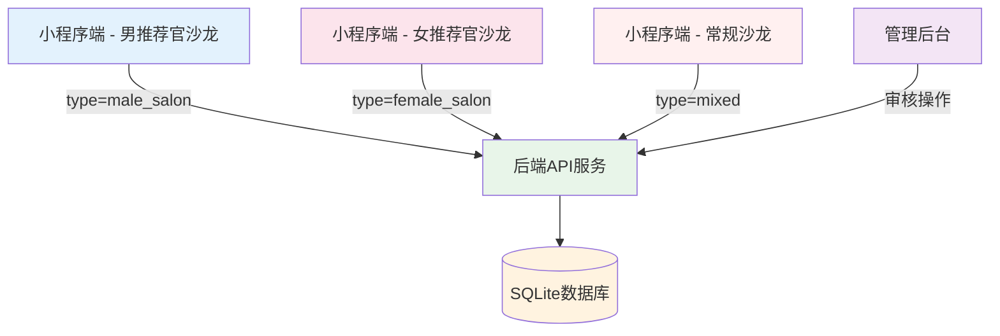

## 产品概述

为"人人媒好"相亲小程序开发完全独立的男推荐官沙龙和女推荐官沙龙功能，与现有常规沙龙（6人小班相亲交友）完全隔离，主打商务对接、人脉拓展、资源合作。

## 核心功能

### 一、列表页（男/女推荐官沙龙独立页面）

- 视觉与文案：商务简约风格，头部标题明确标注「男推荐官沙龙」/「女推荐官沙龙」，禁用相亲类标签与文案
- 活动卡片：推荐官席位上限9人（图形化展示已占/剩余席位）、全场上限27人（统一备注「含随行人员」）、移除常规沙龙男女分组的相亲式布局
- 权限按钮：页面悬浮「申请发布沙龙」按钮，仅认证推荐官可见，非推荐官自动隐藏
- 状态展示：区分正常可报名、名额已满、审核中三种状态

### 二、详情页

- 视觉主题：男推荐官采用蓝色商务风，女推荐官采用粉色商务风，整体版式大气简约
- 席位模块：分两块可视化展示——推荐官席位占用、全场总人数进度（上限27人）
- 报名功能：报名弹窗支持填写本人信息 + 随行人员信息（随行最多添加2人）、强制人数校验（已报名人数+本次报名人数 ≤27）
- 操作按钮（动态渲染）：普通用户显示"立即报名、取消报名"；沙龙创建人（推荐官）显示"管理沙龙、编辑、下架"等商务运营类按钮
- 内容规范：页面所有介绍文案、提示语围绕「商务对接、人脉合作」设计，不得出现相亲、交友相关内容

### 三、创建页

- 类型限制：由对应入口进入后，自动锁定沙龙性别类型，页面内禁止手动修改
- 表单字段 & 引导：封面图、活动标题、活动时间、活动地点、人数上限、活动费用、活动描述；表单提示文案引导填写商务合作、行业交流相关内容
- 人数规则：人数上限默认27人，可自定义调整，上限不超过27人
- 审核流程：表单提交 → 状态变更为「审核中」→ 后台人工审核（通过则正常上线开放报名；驳回则返回编辑并展示驳回原因）→ 审核中的沙龙列表可见但禁止用户报名

## 交付要求

1. 分页面输出完整可运行代码：wxml、wxss、js，清晰标注文件名
2. 补充数据库/接口新增字段、用户身份枚举、沙龙类型枚举
3. 补全权限判断、人数计算、表单校验、状态流转全套逻辑代码
4. 新功能独立运行，不改动原有常规相亲沙龙的代码、样式与业务逻辑

## 技术栈选择

- **前端框架**：微信小程序原生开发（WXML + WXSS + JS）
- **后端框架**：Node.js + Express 5.2.1（复用现有 server.js 架构）
- **数据库**：SQLite (better-sqlite3)
- **认证方式**：JWT (jsonwebtoken)
- **API规范**：RESTful API，路径前缀 `/v1/`

## 实施方法

### 策略：创建完全独立的页面文件，实现数据/样式/权限隔离

根据用户需求"独立路由、独立页面，数据隔离、样式隔离、权限隔离"和"新功能独立运行，不改动原有常规相亲沙龙的代码"，采用以下策略：

1. 创建全新的独立页面文件（不修改现有 salon-list/salon-detail/salon-create）
2. 复用后端现有 API（routes_salon.js 已支持推荐官沙龙）
3. 补充数据库字段（审核状态 audit_status）
4. 实现独立的视觉主题和文案体系

### 关键决策

1. **为何创建独立页面而非复用现有页面？**

- 用户明确要求"独立路由、独立页面"、"不改动原有常规相亲沙龙的代码"
- 商务沙龙与相亲沙龙在视觉、文案、业务逻辑上差异较大
- 独立页面便于后续维护和功能迭代

2. **如何复用现有后端 API？**

- routes_salon.js 已支持 type 参数区分沙龙类型（mixed/male_salon/female_salon）
- 只需补充 audit_status 字段和审核逻辑
- 前端通过不同的页面文件调用相同的 API，但传递不同的 type 参数

3. **如何实现数据隔离？**

- 数据库层面：salons 表通过 type 字段区分（已有）
- 前端层面：独立页面只查询对应 type 的沙龙数据
- 后端层面：API 支持 type 过滤（已有）

### 需要创建的文件

| 文件 | 用途 | 说明 |
| --- | --- | --- |
| `male-salon-list.js/wxml/wxss/json` | 男推荐官沙龙列表页 | 蓝色商务风，推荐官席位可视化 |
| `male-salon-detail.js/wxml/wxss/json` | 男推荐官沙龙详情页 | 蓝色商务风，报名弹窗，动态按钮 |
| `male-salon-create.js/wxml/wxss/json` | 男推荐官沙龙创建页 | 自动锁定类型为 male_salon，审核流程 |
| `female-salon-list.js/wxml/wxss/json` | 女推荐官沙龙列表页 | 粉色商务风，推荐官席位可视化 |
| `female-salon-detail.js/wxml/wxss/wxss/json` | 女推荐官沙龙详情页 | 粉色商务风，报名弹窗，动态按钮 |
| `female-salon-create.js/wxml/wxss/json` | 女推荐官沙龙创建页 | 自动锁定类型为 female_salon，审核流程 |


### 需要修改的文件

| 文件 | 修改内容 | 说明 |
| --- | --- | --- |
| `subpackages/activity/pages.json` | 注册新页面路由 | 添加6个新页面的路由配置 |
| `utils/salon-config.js` | 更新页面路径配置 | 修改 page.list/detail/create 指向新页面 |
| `routes_salon.js` | 补充审核状态逻辑 | 添加 audit_status 字段处理 |
| `server.js` | 数据库迁移 | 添加 audit_status 字段（如不存在） |


## 实施笔记

### 性能考虑

- 新页面独立加载，不影响现有页面性能
- 数据库查询已通过 type 字段索引优化
- 图片上传使用压缩模式，减少带宽消耗

### 日志记录

- 报名操作记录到控制台（便于调试）
- 审核操作记录到数据库（便于追溯）
- 错误异常显示用户友好提示

### 爆炸半径控制

- 只创建新文件，不修改现有沙龙页面代码
- 只补充数据库字段，不修改现有表结构
- 只新增 API 逻辑，不修改现有 API 行为

## 架构设计

### 系统架构图



### 数据流

1. 用户访问独立页面（male-salon-list 或 female-salon-list）
2. 页面加载时根据路径判断沙龙类型（male_salon 或 female_salon）
3. 调用后端 API 获取对应类型的沙龙列表
4. 用户点击进入详情页，展示对应主题的详情信息
5. 用户报名时校验人数上限（27人）和随行人员数量（最多2人）
6. 推荐官创建沙龙时自动锁定类型，提交后进入审核流程

## 目录结构

### 新增文件清单

```
男女推荐官沙龙独立页面 - 文件清单

miniprogram/
├── subpackages/activity/pages/
│   ├── male-salon-list/              [NEW] 男推荐官沙龙列表页
│   │   ├── male-salon-list.js        [NEW] 页面逻辑（蓝色主题、推荐官席位可视化、权限按钮）
│   │   ├── male-salon-list.wxml      [NEW] 页面结构（商务简约风格、禁用相亲类标签）
│   │   ├── male-salon-list.wxss      [NEW] 页面样式（蓝色商务风）
│   │   └── male-salon-list.json      [NEW] 页面配置
│   ├── male-salon-detail/            [NEW] 男推荐官沙龙详情页
│   │   ├── male-salon-detail.js      [NEW] 页面逻辑（蓝色主题、席位模块、报名弹窗、动态按钮）
│   │   ├── male-salon-detail.wxml    [NEW] 页面结构（商务对接文案、人数校验）
│   │   ├── male-salon-detail.wxss    [NEW] 页面样式（蓝色商务风）
│   │   └── male-salon-detail.json    [NEW] 页面配置
│   ├── male-salon-create/            [NEW] 男推荐官沙龙创建页
│   │   ├── male-salon-create.js      [NEW] 页面逻辑（自动锁定类型、表单校验、审核流程）
│   │   ├── male-salon-create.wxml    [NEW] 页面结构（商务合作引导文案）
│   │   ├── male-salon-create.wxss    [NEW] 页面样式（蓝色商务风）
│   │   └── male-salon-create.json    [NEW] 页面配置
│   ├── female-salon-list/            [NEW] 女推荐官沙龙列表页
│   │   ├── female-salon-list.js      [NEW] 页面逻辑（粉色主题、推荐官席位可视化、权限按钮）
│   │   ├── female-salon-list.wxml    [NEW] 页面结构（商务简约风格、禁用相亲类标签）
│   │   ├── female-salon-list.wxss    [NEW] 页面样式（粉色商务风）
│   │   └── female-salon-list.json    [NEW] 页面配置
│   ├── female-salon-detail/          [NEW] 女推荐官沙龙详情页
│   │   ├── female-salon-detail.js    [NEW] 页面逻辑（粉色主题、席位模块、报名弹窗、动态按钮）
│   │   ├── female-salon-detail.wxml  [NEW] 页面结构（商务对接文案、人数校验）
│   │   ├── female-salon-detail.wxss  [NEW] 页面样式（粉色商务风）
│   │   └── female-salon-detail.json  [NEW] 页面配置
│   ├── female-salon-create/          [NEW] 女推荐官沙龙创建页
│   │   ├── female-salon-create.js    [NEW] 页面逻辑（自动锁定类型、表单校验、审核流程）
│   │   ├── female-salon-create.wxml  [NEW] 页面结构（商务合作引导文案）
│   │   ├── female-salon-create.wxss  [NEW] 页面样式（粉色商务风）
│   │   └── female-salon-create.json  [NEW] 页面配置
│   └── pages.json                    [MODIFY] 注册6个新页面的路由配置
├── utils/
│   └── salon-config.js               [MODIFY] 更新页面路径配置（指向新页面）
└── server.js                         [MODIFY] 数据库迁移（添加 audit_status 字段）
```

### 文件详细说明

1. **male-salon-list.js** [NEW]

- 用途：男推荐官沙龙列表页逻辑
- 功能：蓝色商务主题、推荐官席位可视化（9人）、全场人数标注（27人）、权限按钮（仅认证推荐官可见）、状态展示（正常/已满/审核中）
- 实现要求：复用 salon-config.js 配置，调用 API.SALON.LIST 并传递 type=male_salon

2. **male-salon-list.wxml** [NEW]

- 用途：男推荐官沙龙列表页结构
- 功能：商务简约风格、头部标题「男推荐官沙龙」、活动卡片（推荐官席位可视化、全场人数备注）、悬浮按钮（申请发布沙龙）
- 实现要求：禁用相亲类标签与文案，使用商务对接相关文案

3. **male-salon-list.wxss** [NEW]

- 用途：男推荐官沙龙列表页样式
- 功能：蓝色商务风主题色（#1565C0）、商务简约风格
- 实现要求：与常规沙龙样式完全隔离

4. **male-salon-detail.js** [NEW]

- 用途：男推荐官沙龙详情页逻辑
- 功能：蓝色商务主题、席位模块（推荐官席位占用、全场总人数进度）、报名弹窗（本人信息+随行人员信息，最多2人）、人数校验（≤27人）、动态按钮（普通用户/创建人）
- 实现要求：文案围绕「商务对接、人脉合作」，不得出现相亲、交友内容

5. **female-salon-list.js** [NEW]

- 用途：女推荐官沙龙列表页逻辑
- 功能：粉色商务主题、推荐官席位可视化（9人）、全场人数标注（27人）、权限按钮（仅认证推荐官可见）、状态展示（正常/已满/审核中）
- 实现要求：复用 salon-config.js 配置，调用 API.SALON.LIST 并传递 type=female_salon

6. **female-salon-detail.js** [NEW]

- 用途：女推荐官沙龙详情页逻辑
- 功能：粉色商务主题、席位模块（推荐官席位占用、全场总人数进度）、报名弹窗（本人信息+随行人员信息，最多2人）、人数校验（≤27人）、动态按钮（普通用户/创建人）
- 实现要求：文案围绕「商务对接、人脉合作」，不得出现相亲、交友内容

7. **male-salon-create.js** [NEW]

- 用途：男推荐官沙龙创建页逻辑
- 功能：自动锁定类型为 male_salon、表单字段（封面图、标题、时间、地点、人数上限、费用、描述）、人数规则（默认27人，上限27人）、审核流程（提交→审核中→通过/驳回）
- 实现要求：表单提示文案引导填写商务合作、行业交流相关内容

8. **female-salon-create.js** [NEW]

- 用途：女推荐官沙龙创建页逻辑
- 功能：自动锁定类型为 female_salon、表单字段（封面图、标题、时间、地点、人数上限、费用、描述）、人数规则（默认27人，上限27人）、审核流程（提交→审核中→通过/驳回）
- 实现要求：表单提示文案引导填写商务合作、行业交流相关内容

9. **subpackages/activity/pages.json** [MODIFY]

- 用途：注册新页面路由
- 修改内容：添加 male-salon-list、male-salon-detail、male-salon-create、female-salon-list、female-salon-detail、female-salon-create 的路由配置
- 实现要求：确保路由可访问

10. **utils/salon-config.js** [MODIFY]

    - 用途：更新页面路径配置
    - 修改内容：修改 SALON_TYPE_CONFIG 中 male_salon 和 female_salon 的 page.list/detail/create 指向新页面
    - 实现要求：确保现有功能不受影响

11. **server.js** [MODIFY]

    - 用途：数据库迁移
    - 修改内容：添加 audit_status 字段（如不存在）
    - 实现要求：兼容已有数据

12. **routes_salon.js** [MODIFY]

    - 用途：补充审核状态逻辑
    - 修改内容：处理 audit_status 字段（pending/approved/rejected）、审核通过/驳回接口
    - 实现要求：确保审核流程完整

## 数据库设计

### 新增字段

```sql
-- 沙龙表新增字段
ALTER TABLE salons ADD COLUMN audit_status TEXT DEFAULT 'pending';  -- 审核状态：pending/approved/rejected
ALTER TABLE salons ADD COLUMN reject_reason TEXT;                    -- 驳回原因
```

### 审核状态枚举

| 状态 | 说明 |
| --- | --- |
| pending | 审核中（用户提交后） |
| approved | 审核通过（管理员操作） |
| rejected | 审核驳回（管理员操作，附驳回原因） |


### 沙龙类型枚举（已有）

| 类型 | 说明 |
| --- | --- |
| mixed | 常规沙龙（6人小班，相亲交友） |
| male_salon | 男推荐官沙龙（商务对接，上限27人） |
| female_salon | 女推荐官沙龙（商务对接，上限27人） |


## 设计风格

采用商务简约风格，男推荐官沙龙采用蓝色商务风，女推荐官沙龙采用粉色商务风，整体版式大气简约。

## 设计内容描述

### 列表页设计

#### 页面头部

- 背景：渐变色（男：蓝色渐变 #1565C0 → #42A5F5；女：粉色渐变 #C2185B → #F06292）
- 标题：「男推荐官沙龙」/「女推荐官沙龙」，字体大小 36rpx，加粗，白色
- 副标题：「商务对接 · 人脉拓展 · 资源合作」，字体大小 24rpx，白色，透明度 0.8
- 徽章：3个圆形徽章（每场27人、可带朋友、审核制），白色边框，透明背景

#### 活动卡片

- 卡片背景：白色，圆角 16rpx，阴影 0 4rpx 12rpx rgba(0,0,0,0.08)
- 封面图：宽度 100%，高度 320rpx，圆角 16rpx 16rpx 0 0
- 标题：字体大小 32rpx，加粗，颜色 #333
- 时间：字体大小 24rpx，颜色 #666，图标 📅
- 地点：字体大小 24rpx，颜色 #666，图标 📍
- 推荐官席位：9个圆形图标（已占用为实心，未占用为空心），下方标注「推荐官席位 已占X/9」
- 人数标注：字体大小 22rpx，颜色 #999，「全场27人封顶（含随行人员）」
- 费用：¥ + 金额，字体大小 36rpx，加粗，主题色
- 状态标签：正常可报名（绿色）、名额已满（红色）、审核中（橙色）

#### 权限按钮

- 悬浮按钮：固定在页面右下角，圆形，直径 100rpx，主题色背景，白色「+」图标和「申请发布」文字
- 权限控制：仅认证推荐官（isMatchmaker=true）可见，其他用户自动隐藏

### 详情页设计

#### 页面头部

- 封面图：宽度 100%，高度 400rpx，渐变遮罩（底部→透明）
- 标题：字体大小 36rpx，加粗，白色，阴影
- 状态标签：正常可报名（绿色）、名额已满（红色）、审核中（橙色）

#### 席位模块

- 推荐官席位：标题「推荐官席位」，9个圆形进度条（已占用为实心，未占用为空心），下方标注「已占 X/9」
- 全场人数：标题「全场人数」，进度条（已报名人数/27人），下方标注「已报名 X/27人（含随行人员）」

#### 活动信息

- 时间：📅 + 活动日期和时间
- 地点：📍 + 活动地点
- 费用：💰 + 报名费用
- 描述：📝 + 活动描述（商务对接、人脉合作相关内容）

#### 报名弹窗

- 弹窗标题：「报名活动」
- 本人信息：姓名（必填）、手机（必填）、性别（自动填充，禁止修改）、年龄（选填）、行业（选填）
- 随行人员：最多添加2人，每人需填写姓名和手机
- 确认按钮：「确认报名」，主题色背景，白色文字
- 取消按钮：「取消」，灰色背景

#### 操作按钮（动态渲染）

- 普通用户：
- 「立即报名」：主题色背景，白色文字，点击弹出报名弹窗
- 「取消报名」：灰色背景，黑色文字，点击取消报名
- 沙龙创建人（推荐官）：
- 「管理沙龙」：主题色背景，白色文字
- 「编辑」：灰色背景，黑色文字
- 「下架」：红色背景，白色文字

### 创建页设计

#### 表单字段

- 封面图：点击上传，显示预览，尺寸比例 16:9
- 活动标题：输入框，占位符「请输入活动标题，如：互联网行业交流沙龙」
- 活动时间：日期选择器 + 时间选择器，开始时间和结束时间
- 活动地点：输入框，占位符「请输入活动地点」
- 人数上限：输入框，默认27，可自定义调整，上限27
- 活动费用：输入框，默认399，可自定义调整
- 活动描述：文本域，占位符「请输入活动描述，如：本次活动旨在促进行业内人士的交流与合作...」

#### 表单引导

- 封面图：提示「建议上传与商务交流相关的图片」
- 活动标题：提示「标题应简洁明了，体现活动主题」
- 活动描述：提示「描述应包含活动目的、流程、亮点等信息，吸引目标人群参加」

#### 提交按钮

- 「提交审核」：主题色背景，白色文字，点击提交表单，状态变更为「审核中」
- 取消按钮：「取消」，灰色背景，点击返回上一页

### 响应式设计

- 适配不同屏幕尺寸（iPhone SE → iPad）
- 字体大小使用 rpx 单位，自适应屏幕宽度
- 图片使用 mode="aspectFill" 保持比例

### 交互设计

- 按钮点击效果：透明度变化（0.8）
- 卡片点击效果：阴影变化（0 8rpx 24rpx rgba(0,0,0,0.12)）
- 弹窗动画：从底部滑出，背景半透明黑色
- 加载动画：旋转圆圈，主题色

## Agent Extensions

### Skill

- **miniprogram-development**
- 目的：构建、调试、预览、测试、发布小程序项目
- 预期结果：确保新建页面功能正常、样式正确、权限隔离

### SubAgent

- **code-explorer**
- 目的：搜索现有代码库，了解项目结构和实现细节
- 预期结果：确保新页面与现有代码风格一致，复用已有逻辑