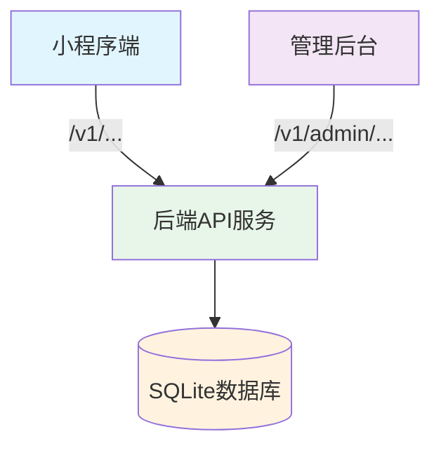

## 产品概述

修复管理后台API路径前缀不一致问题，将管理后台的API调用从 `/api/admin/...` 统一改为 `/v1/admin/...`，与小程序端保持一致，确保全面打通且不影响小程序运行。

## 核心功能

1. 修改管理后台4个service文件中的API路径前缀（`/api/admin/` → `/v1/admin/`）
2. 重新构建管理后台并部署到生产环境
3. 验证管理后台功能恢复正常
4. 确保小程序端不受影响（保持向后兼容）

## 技术栈选择

- **前端框架**：React 18 + TypeScript（管理后台）
- **后端框架**：Node.js + Express 5.2.1
- **数据库**：SQLite (better-sqlite3)
- **HTTP客户端**：axios（管理后台）+ wx.request（小程序端）
- **认证方式**：JWT (jsonwebtoken)

## 实施方法

### 策略：统一API路径前缀

将所有管理后台的API调用从 `/api/admin/...` 改为 `/v1/admin/...`，与小程序端保持一致。

### 关键决策

1. **为何修改管理后台而非后端添加兼容路由？**

- 更符合RESTful API版本管理最佳实践
- 与小程序端保持一致（都使用 `/v1/...` 前缀）
- 减少后端兼容代码，简化路由注册逻辑
- 部分管理后台文件已经在使用 `/v1/admin/...` 前缀

2. **如何保证小程序不崩溃？**

- 只修改管理后台代码，不修改后端路由
- 小程序端继续使用 `/v1/...` 前缀，不受影响
- 后端已兼容部分 `/api/...` 路径（server.js 第170-201行），作为安全网

### 需要修改的文件

| 文件 | 当前API路径 | 修改为 | 状态 |
| --- | --- | --- | --- |
| `admin-panel/src/services/user.service.ts` | `/api/admin/users` | `/v1/admin/users` | ❌ 需要修复 |
| `admin-panel/src/services/order.service.ts` | `/api/admin/orders` | `/v1/admin/orders` | ❌ 需要修复 |
| `admin-panel/src/services/fund-custody.service.ts` | `/api/admin/fund-custody` | `/v1/admin/fund-custody` | ❌ 需要修复 |
| `admin-panel/src/services/referral-code.service.ts` | `/api/admin/referral-codes` | `/v1/admin/referral-codes` | ❌ 需要修复 |


### 已经正确的文件（无需修改）

- `score.service.ts` - 已使用 `API_BASE = '/v1/admin'`
- `activity.service.ts` - 已使用 `/v1/admin/activities`
- `commission.service.ts` - 已使用 `API_BASE = '/v1/admin'`
- `config.service.ts` - 已使用 `API_BASE = '/v1/admin'`
- `premium.service.ts` - 已使用 `API_BASE = '/v1/admin'`

## 实施笔记

### 性能考虑

- 只修改4个文件，影响范围小
- 使用 `try-catch` 包裹后端路由加载（已有），避免加载失败导致服务崩溃
- 分步测试，确保每步都可行

### 日志记录

- 修改前：备份当前管理后台构建文件
- 修改后：查看后端API日志，确认无错误
- 部署后：测试管理后台功能，记录测试结果

### 爆炸半径控制

- 只修改管理后台service文件，不修改后端代码
- 保留后端兼容代码（server.js 第170-201行），作为安全网
- 先本地测试，再部署到生产环境

## 架构设计

### 系统架构图



### 数据流

1. 小程序端发送请求（`/v1/...` 前缀）
2. 管理后台发送请求（`/v1/admin/...` 前缀，修改后）
3. 后端API服务接收请求并处理
4. 数据库操作
5. 返回响应

## 目录结构

### 修改文件清单

```
管理后台API路径修复 - 文件清单

miniprogram/
├── admin-panel/
│   └── src/
│       └── services/
│           ├── user.service.ts         [MODIFY] 修改API路径：/api/admin/users → /v1/admin/users
│           ├── order.service.ts        [MODIFY] 修改API路径：/api/admin/orders → /v1/admin/orders
│           ├── fund-custody.service.ts [MODIFY] 修改API路径：/api/admin/fund-custody → /v1/admin/fund-custody
│           └── referral-code.service.ts [MODIFY] 修改API路径：/api/admin/referral-codes → /v1/admin/referral-codes
└── server.js                      [NO CHANGE] 后端代码不修改，保留兼容代码
```

### 文件详细说明

1. **user.service.ts** [MODIFY]

- 用途：用户管理API服务
- 修改内容：将第33、39、44行的 `/api/admin/users` 改为 `/v1/admin/users`
- 实现要求：确保API路径正确，与后端路由一致

2. **order.service.ts** [MODIFY]

- 用途：订单管理API服务
- 修改内容：将第38行的 `/api/admin/orders` 改为 `/v1/admin/orders`
- 实现要求：确保API路径正确，与后端路由一致

3. **fund-custody.service.ts** [MODIFY]

- 用途：资金托管API服务
- 修改内容：将第41、46行的 `/api/admin/fund-custody` 改为 `/v1/admin/fund-custody`
- 实现要求：确保API路径正确，与后端路由一致

4. **referral-code.service.ts** [MODIFY]

- 用途：推荐码管理API服务
- 修改内容：将第32、53、58、63、68、73、78行的 `/api/admin/referral-codes` 改为 `/v1/admin/referral-codes`
- 实现要求：确保API路径正确，与后端路由一致

5. **server.js** [NO CHANGE]

- 用途：后端服务入口
- 修改内容：不修改，保留现有兼容代码
- 原因：保证向后兼容，防止意外崩溃

## Agent Extensions

### Skill

- **miniprogram-development**
- 目的：构建、调试、预览、测试、发布小程序项目
- 预期结果：确保小程序端在修复后仍能正常工作

- **wechat-article-search**
- 目的：搜索微信公众号文章，获取最新信息和最佳实践
- 预期结果：了解API路径管理的最佳实践，确保修复方案合理