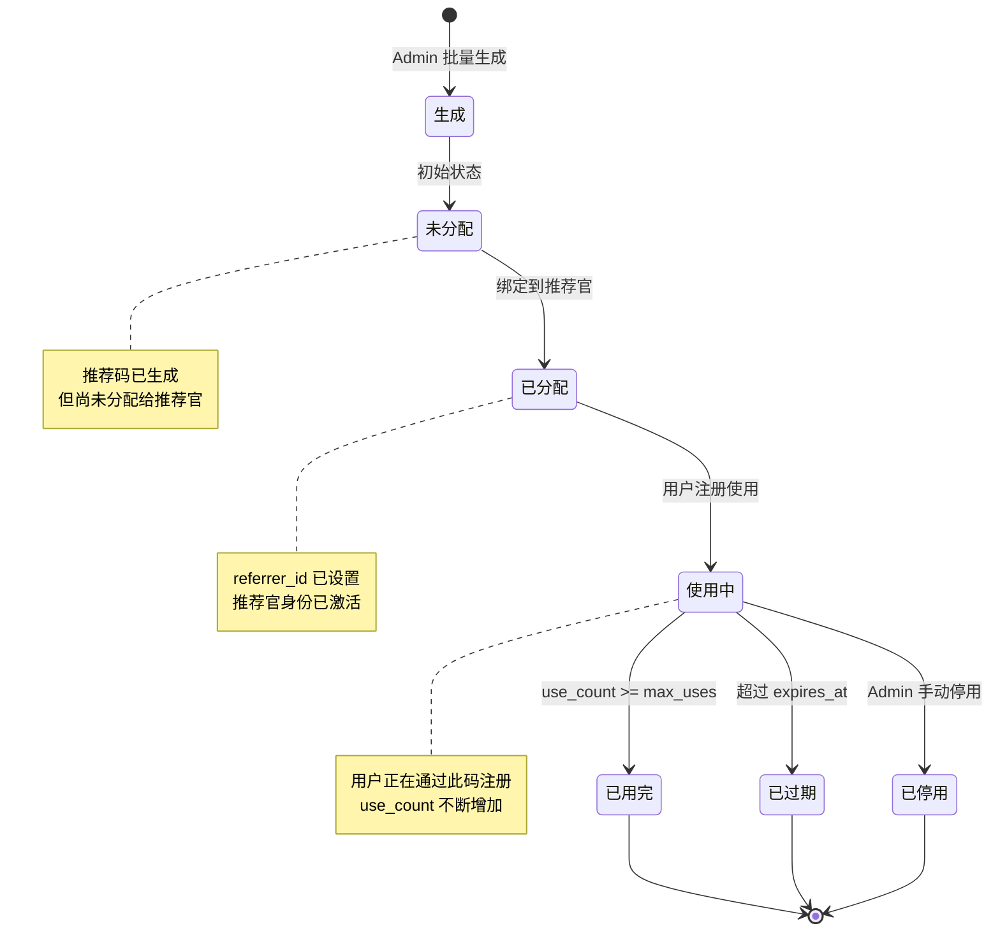
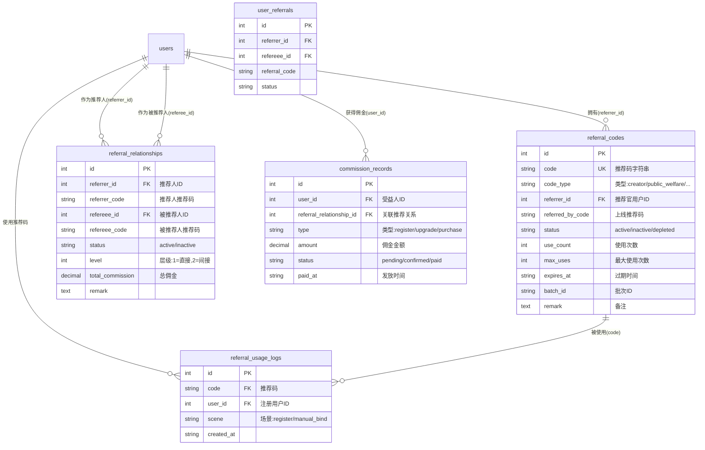
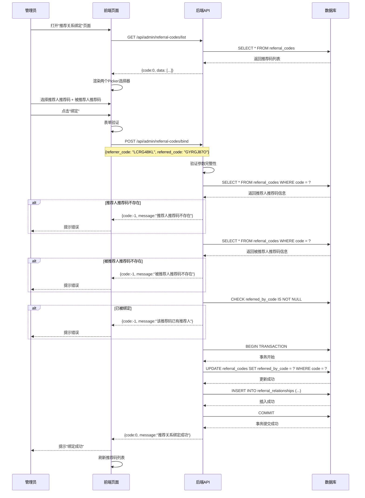
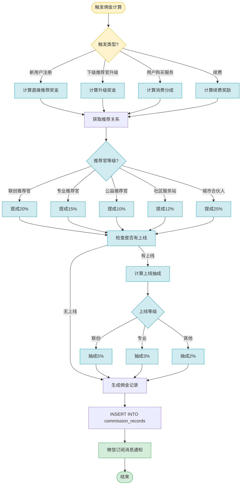

# 人人媒好 - 推荐码管理系统流程图

## 一、完整业务流程图

```mermaid
flowchart TD
    Start([新用户/推荐官注册]) --> InputCode{输入推荐码?}
    
    InputCode -->|是| VerifyCode[验证推荐码]
    InputCode -->|否| Register[直接注册]
    
    VerifyCode -->|有效| BindUser[建立用户推荐关系]
    VerifyCode -->|无效| ShowError[提示:推荐码无效]
    
    BindUser --> UpdateCode[更新推荐码使用次数]
    UpdateCode --> UpdateUser[设置用户.referrer_id]
    UpdateUser --> Register
    
    Register --> UserRole{用户身份?}
    
    UserRole -->|普通用户| NormalUser[普通用户主页]
    UserRole -->|申请推荐官| ApplyPage[推荐官申请页]
    
    ApplyPage --> ChooseType[选择推荐官类型]
    ChooseType --> SubmitApply[提交申请]
    SubmitApply --> AdminReview{管理员审核}
    
    AdminReview -->|通过| AssignCode[分配推荐码]
    AdminReview -->|拒绝| NotifyReject[通知拒绝]
    
    AssignCode --> BindCodeToUser[绑定推荐码到用户]
    BindCodeToUser --> ActivateReferrer[激活推荐官身份]
    ActivateReferrer --> ReferrerDashboard[推荐官工作台]
    
    ReferrerDashboard --> DevelopUsers[发展用户/推荐官]
    DevelopUsers --> NewUserReg[新用户注册]
    NewUserReg --> BindUser
    
    ReferrerDashboard --> BindSubReferrer[绑定下级推荐官]
    BindSubReferrer --> CheckSubCode{下级推荐码存在?}
    CheckSubCode -->|是| CheckNotBound{未被绑定?}
    CheckSubCode -->|否| Error1[提示:推荐码不存在]
    
    CheckNotBound -->|是| BindRelationship[建立推荐关系]
    CheckNotBound -->|否| Error2[提示:已有推荐人]
    
    BindRelationship --> UpdateReferredBy[更新 referred_by_code]
    UpdateReferredBy --> LogRelationship[记录到 referral_relationships]
    LogRelationship --> CalcCommission[计算佣金]
    
    CalcCommission --> CommissionRecord[生成佣金记录]
    CommissionRecord --> CommissionStatus{佣金状态}
    
    CommissionStatus -->|pending| WaitConfirm[等待确认]
    CommissionStatus -->|confirmed| ReadyPay[准备发放]
    CommissionStatus -->|paid| AlreadyPaid[已发放]
    
    WaitConfirm --> AdminConfirm[管理员确认]
    AdminConfirm --> ReadyPay
    ReadyPay --> WechatPay[微信支付到推荐官]
    WechatPay --> NotifyPaid[通知到账]
    
    ReferrerDashboard --> ViewTeam[查看团队]
    ViewTeam --> ShowTree[显示推荐树]
    
    classDef success fill:#d4edda,stroke:#28a745
    classDef error fill:#f8d7da,stroke:#dc3545
    classDef process fill:#d1ecf1,stroke:#17a2b8
    
    class BindUser,UpdateCode,UpdateUser,ActivateReferrer,BindRelationship success
    class ShowError,Error1,Error2 error
    class AdminReview,AdminConfirm,WechatPay process
```



## 二、推荐码生命周期图



## 三、数据库表关系图



## 四、推荐关系绑定时序图



## 五、佣金计算流程图



## 六、关键业务规则

### 1. 推荐码生成规则
- **公益推荐官**：前缀 `GYRG` + 4位随机字符
- **联创推荐官**：前缀 `LCRG` + 4位随机字符
- **专业推荐官**：前缀 `ZYRG` + 4位随机字符
- **社区服务站**：前缀 `SQZD` + 4位随机字符
- **城市合伙人**：前缀 `CSHH` + 4位随机字符

### 2. 推荐关系层级
- **Level 1**：直接推荐（A 推荐 B）
- **Level 2**：间接推荐（A 推荐 B，B 推荐 C，A 获得 C 的间接奖励）

### 3. 佣金结算周期
- **T+1**：用户注册/升级触发佣金（pending）
- **T+7**：管理员确认无异常后（confirmed）
- **每月15日**：批量发放上月 confirmed 佣金（paid）

### 4. 防作弊机制
- 同一 IP 24小时内只能使用 3 次推荐码
- 推荐关系建立后 7 天内不能解除
- 退款订单对应的佣金自动扣除

---

## 附录：快速 SQL 查询

### 查询推荐官的完整团队
```sql
WITH RECURSIVE team AS (
    -- 初始：指定推荐官的直接下线
    SELECT 
        rr.referee_id,
        rr.referrer_code,
        rr.referee_code,
        rr.level,
        1 as depth
    FROM referral_relationships rr
    WHERE rr.referrer_id = ?  -- 输入推荐官ID
    
    UNION ALL
    
    -- 递归：下线的下线
    SELECT 
        rr.referee_id,
        rr.referrer_code,
        rr.referee_code,
        rr.level,
        t.depth + 1
    FROM referral_relationships rr
    INNER JOIN team t ON rr.referrer_id = t.referee_id
    WHERE t.depth < 5  -- 最多5层
)
SELECT * FROM team;
```

### 统计推荐官业绩
```sql
SELECT 
    u.id,
    u.nickname,
    rc.code as referral_code,
    COUNT(DISTINCT rr.referee_id) as total_referees,
    COUNT(DISTINCT CASE WHEN u_reg.created_at >= date('now', '-30 days') THEN rr.referee_id END) as month_new,
    COALESCE(SUM(cr.amount), 0) as total_commission
FROM users u
LEFT JOIN referral_codes rc ON rc.referrer_id = u.id
LEFT JOIN referral_relationships rr ON rr.referrer_id = u.id
LEFT JOIN commission_records cr ON cr.user_id = u.id AND cr.status = 'paid'
WHERE u.role IN ('creator', 'professional', 'public_welfare')
GROUP BY u.id;
```
