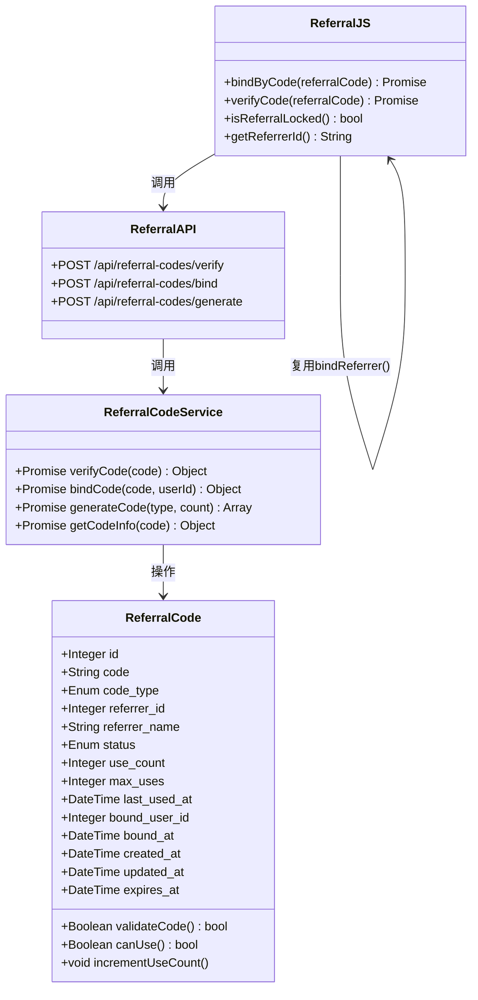
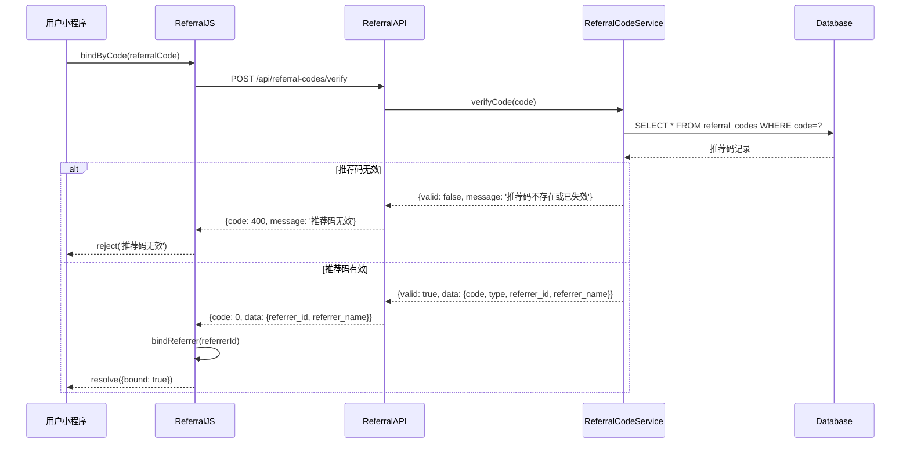
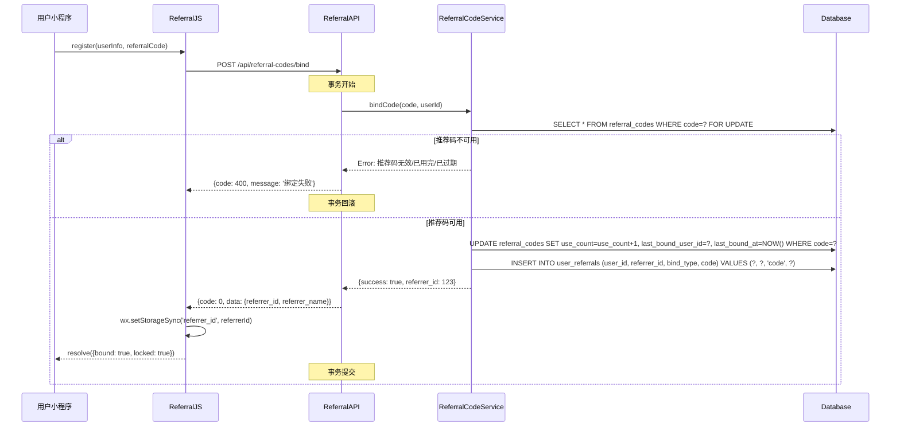
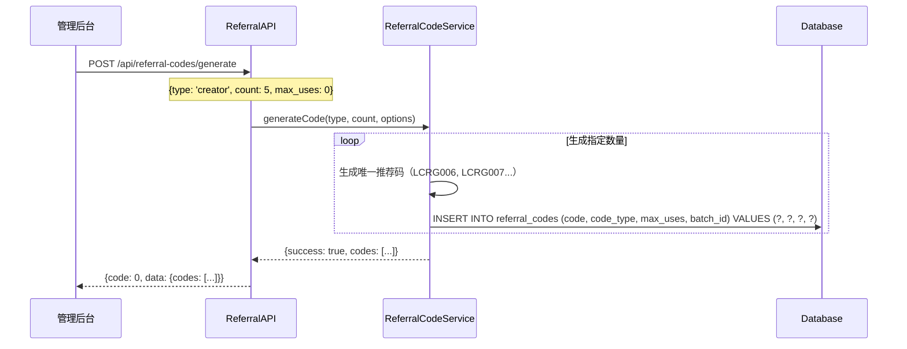
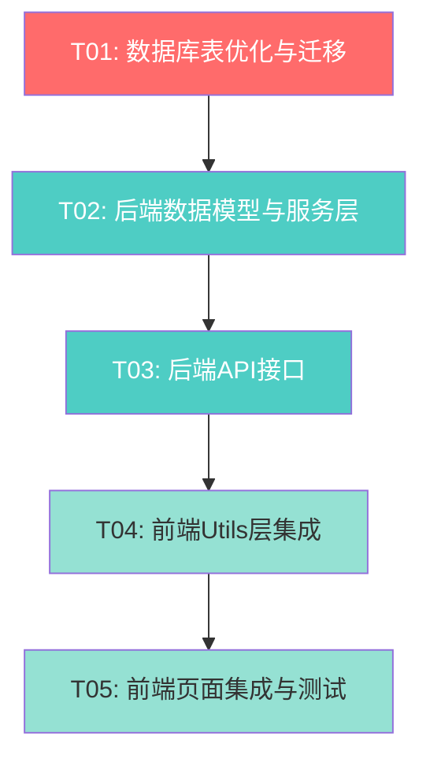

# 推荐码系统 - 技术设计方案

**文档版本**: v1.0  
**创建日期**: 2025-01-15  
**架构师**: Bob (software-architect)  
**项目**: 相亲小程序推荐码系统  

---

## Part A: 系统设计

### 1. 实现方案 (Implementation Approach)

#### 1.1 核心技术挑战

1. **推荐码验证与绑定的原子性**：防止同一推荐码被多人同时使用导致数据不一致
2. **兼容性设计**：新增推荐码逻辑不能破坏现有基于用户ID的推荐关系绑定
3. **推荐码状态管理**：需要跟踪推荐码的使用情况、有效期、绑定历史
4. **前端集成的最小侵入性**：尽量复用现有 `utils/referral.js` 的逻辑

#### 1.2 技术选型

| 技术层 | 选型 | 理由 |
|--------|------|------|
| 后端框架 | Node.js + 现有后端框架 | 保持技术栈一致 |
| 数据库 | MySQL + InnoDB | 支持事务，保证数据一致性 |
| 前端 | 微信小程序原生 + 云开发 | 项目既有技术栈 |
| API风格 | RESTful + JSON | 与现有API保持一致 |

#### 1.3 架构模式

采用 **分层架构**：
- **API层**：处理HTTP请求、参数验证
- **Service层**：推荐码业务逻辑（验证、绑定、生成）
- **Data层**：数据库操作、ORM映射
- **前端Utils层**：封装推荐码API调用、与现有referral系统整合

---

### 2. 文件列表 (File List)

```
miniprogram/
├── docs/
│   ├── system_design.md              # 本设计文档
│   ├── sequence-diagram.mermaid      # 序列图
│   └── class-diagram.mermaid         # 类图
├── utils/
│   └── referral.js                   # 【修改】增加bindByCode方法
├── pages/
│   └── register/                     # 【修改】注册页增加推荐码输入
│       └── register.js
├── server/
│   ├── api/
│   │   └── referral-codes/
│   │       ├── verify.js             # POST /api/referral-codes/verify
│   │       ├── bind.js               # POST /api/referral-codes/bind
│   │       └── generate.js           # POST /api/referral-codes/generate (管理后台)
│   ├── models/
│   │   └── ReferralCode.js          # 推荐码数据模型
│   └── services/
│       └── ReferralCodeService.js    # 推荐码业务逻辑
└── database/
    └── migrations/
        └── 20250115_create_referral_codes.sql  # 优化的推荐码表
```

---

### 3. 数据结构与接口 (Data Structures and Interfaces)



#### 3.1 优化的 `referral_codes` 表结构

**优化建议**：
1. 增加 `used_count` 字段重命名为 `use_count`（保持一致性）
2. 增加 `created_by` 字段（记录管理员ID，用于审计）
3. 增加 `notes` 字段（管理员备注）
4. 修改 `referrer_id` 为 `INT` 并添加外键约束（关联用户表）
5. 增加 `batch_id` 字段（批次管理，方便批量生成和统计）

**优化后的SQL**：

```sql
CREATE TABLE IF NOT EXISTS referral_codes (
  id INT PRIMARY KEY AUTO_INCREMENT,
  
  -- 推荐码信息
  code VARCHAR(20) NOT NULL UNIQUE COMMENT '推荐码（唯一）',
  code_type ENUM('creator', 'public_welfare') NOT NULL COMMENT '推荐码类型：联创推荐官/公益推荐官',
  
  -- 关联的推荐官
  referrer_id INT DEFAULT NULL COMMENT '推荐官用户ID（NULL表示未分配）',
  
  -- 状态管理
  status ENUM('active', 'inactive', 'expired', 'depleted') DEFAULT 'active' COMMENT '推荐码状态：激活/未激活/过期/已用完',
  
  -- 使用统计
  use_count INT DEFAULT 0 COMMENT '已使用次数',
  max_uses INT DEFAULT 0 COMMENT '最大使用次数（0表示无限制）',
  
  -- 时间戳
  created_at DATETIME DEFAULT CURRENT_TIMESTAMP,
  updated_at DATETIME DEFAULT CURRENT_TIMESTAMP ON UPDATE CURRENT_TIMESTAMP,
  expires_at DATETIME DEFAULT NULL COMMENT '过期时间（NULL表示永不过期）',
  last_used_at DATETIME DEFAULT NULL COMMENT '最后一次使用时间',
  
  -- 绑定信息（最近一次）
  last_bound_user_id INT DEFAULT NULL COMMENT '最近绑定的用户ID',
  last_bound_at DATETIME DEFAULT NULL COMMENT '最近绑定时间',
  
  -- 管理字段
  created_by INT DEFAULT NULL COMMENT '创建者管理员ID',
  batch_id VARCHAR(50) DEFAULT NULL COMMENT '批次号（用于批量管理）',
  notes VARCHAR(500) DEFAULT '' COMMENT '管理员备注',
  
  -- 索引
  UNIQUE KEY uk_code (code),
  INDEX idx_referrer (referrer_id),
  INDEX idx_type (code_type),
  INDEX idx_status (status),
  INDEX idx_batch (batch_id),
  INDEX idx_created (created_at),
  
  -- 外键约束（可选，取决于用户表）
  -- FOREIGN KEY (referrer_id) REFERENCES users(id) ON DELETE SET NULL
) ENGINE=InnoDB DEFAULT CHARSET=utf8mb4 COLLATE=utf8mb4_unicode_ci COMMENT='推荐码表';
```

**优化点说明**：
1. ✅ 移除 `referrer_name` 冗余字段（可从用户表联表查询）
2. ✅ 增加 `depleted` 状态（使用次数用完）
3. ✅ 字段重命名：`bound_user_id` → `last_bound_user_id`，`bound_at` → `last_bound_at`（更准确）
4. ✅ 增加 `batch_id` 支持批量管理
5. ✅ 增加 `created_by` 和 `notes` 审计字段

---

### 4. 程序调用流程 (Program Call Flow)

#### 4.1 推荐码验证流程



#### 4.2 推荐码绑定流程



#### 4.3 推荐码生成流程（管理后台）



---

### 5. 任何不明确之处 (Anything UNCLEAR)

1. **推荐码与推荐官的绑定时机**：
   - 方案A：推荐码生成时即绑定推荐官（需要推荐官先注册）
   - 方案B：推荐码先生成，使用后自动绑定到推荐官
   - **建议**：采用方案A，保证推荐码与推荐官的一一对应关系

2. **推荐码使用次数限制**：
   - `max_uses=0` 表示无限制，是否需要设置上限？
   - **建议**：联创推荐码建议限制最多100次，公益推荐码无限制

3. **现有用户表的字段**：
   - 假设用户表为 `users`，字段至少有 `id`, `nickname`, `role`
   - 如果字段名不同，需要相应调整

4. **推荐关系绑定表**：
   - 假设已有 `user_referrals` 表记录推荐关系
   - 如果没有，需要新建此表

5. **微信小程序码（二维码）**：
   - 推荐码是否需要生成对应的小程序二维码？
   - **建议**：第一期先实现推荐码文本输入，第二期增加扫码功能

---

## Part B: 任务分解 (Task Decomposition)

### 6. 所需依赖包 (Required Packages)

后端（Node.js）：
```
- koa@^2.14.0: Web框架
- koa-router@^12.0.0: 路由管理
- mysql2@^3.6.0: MySQL客户端
- koa-bodyparser@^4.4.0: 请求体解析
```

前端（微信小程序）：
```
- 无需额外依赖（使用原生API）
```

---

### 7. 任务清单（按依赖顺序）(Task List)

#### **T01: 数据库表优化与迁移** ⚠️ **必须先执行**

- **任务名称**：优化 `referral_codes` 表结构并执行迁移
- **源文件**：
  - `database/migrations/20250115_create_referral_codes_optimized.sql`（新建）
  - `database/migrations/20250115_alter_referral_codes.sql`（如果是修改现有表）
- **依赖**：无
- **优先级**：P0（阻塞其他所有任务）
- **详细说明**：
  1. 创建优化后的 `referral_codes` 表（如果表不存在）
  2. 如果已执行原始SQL，需要编写 `ALTER TABLE` 迁移脚本
  3. 验证表结构正确性
  4. 插入首批10个推荐码（如果尚未插入）

#### **T02: 后端数据模型与服务层**

- **任务名称**：实现推荐码数据模型 (Model) 和业务逻辑 (Service)
- **源文件**：
  - `server/models/ReferralCode.js`（新建）
  - `server/services/ReferralCodeService.js`（新建）
- **依赖**：T01（需要表结构）
- **优先级**：P0
- **详细说明**：
  1. `ReferralCode` Model：映射 `referral_codes` 表，提供CRUD方法
  2. `ReferralCodeService`：封装业务逻辑
     - `verifyCode(code)` - 验证推荐码有效性
     - `bindCode(code, userId)` - 绑定推荐码到用户（事务）
     - `generateCode(type, count, options)` - 生成推荐码
     - `getCodeInfo(code)` - 查询推荐码详情
  3. 单元测试

#### **T03: 后端API接口**

- **任务名称**：实现推荐码相关API接口
- **源文件**：
  - `server/api/referral-codes/verify.js`（新建）
  - `server/api/referral-codes/bind.js`（新建）
  - `server/api/referral-codes/generate.js`（新建）
  - `server/router/referral-codes.js`（新建，路由配置）
- **依赖**：T02（需要Service层）
- **优先级**：P0
- **详细说明**：
  1. `POST /api/referral-codes/verify` - 验证推荐码
     - Request: `{code: 'LCRG001'}`
     - Response: `{code: 0, data: {code, type, referrer_id, referrer_name}}`
  2. `POST /api/referral-codes/bind` - 绑定推荐码
     - Request: `{code: 'LCRG001', user_id: 123}`
     - Response: `{code: 0, data: {bound: true}}`
  3. `POST /api/referral-codes/generate` - 生成推荐码（管理后台）
     - Request: `{type: 'creator', count: 5, max_uses: 0}`
     - Response: `{code: 0, data: {codes: [...]}}`
  4. 参数验证、错误处理、权限控制（生成接口需要管理员权限）

#### **T04: 前端Utils层集成**

- **任务名称**：修改 `utils/referral.js`，增加推荐码支持
- **源文件**：
  - `utils/referral.js`（修改）
  - `utils/referral-code-api.js`（新建，推荐码API调用封装）
- **依赖**：T03（需要API接口）
- **优先级**：P1
- **详细说明**：
  1. 在 `utils/referral.js` 中增加方法：
     - `bindByCode(referralCode)` - 通过推荐码绑定推荐官
     - `verifyCode(referralCode)` - 验证推荐码（可选，供UI调用）
  2. `bindByCode()` 实现逻辑：
     - 调用 `POST /api/referral-codes/verify` 验证推荐码
     - 如果有效，提取 `referrer_id`
     - 调用现有 `bindReferrer(referrerId)` 完成绑定
     - 返回绑定结果
  3. 创建 `utils/referral-code-api.js` 封装API调用（保持代码整洁）

#### **T05: 前端页面集成与测试**

- **任务名称**：注册页面增加推荐码输入，端到端测试
- **源文件**：
  - `pages/register/register.js`（修改）
  - `pages/register/register.wxml`（修改）
  - `pages/register/register.wxss`（修改）
  - `test/referral-code.e2e.js`（新建，端到端测试）
- **依赖**：T04（需要前端Utils层）
- **优先级**：P1
- **详细说明**：
  1. 在注册页面增加"推荐码（选填）"输入框
  2. 注册时调用 `bindByCode()` 绑定推荐码
  3. 如果推荐码无效，提示用户但允许继续注册（推荐码是选填的）
  4. 编写端到端测试：
     - 测试推荐码验证成功/失败场景
     - 测试推荐码绑定成功/失败场景
     - 测试推荐码使用次数限制
     - 测试与现有推荐关系绑定的兼容性

---

### 8. 共享知识 (Shared Knowledge)

#### 8.1 API响应格式规范

所有API响应统一使用以下格式：

```json
{
  "code": 0,          // 0表示成功，非0表示错误码
  "data": {},         // 成功时的数据
  "message": "",      // 错误时的提示信息
  "request_id": ""    // 请求ID（用于追踪）
}
```

错误码定义：
- `0`: 成功
- `400`: 参数错误
- `404`: 推荐码不存在
- `409`: 推荐码已失效/已用完
- `500`: 服务器内部错误

#### 8.2 推荐码格式规范

- **联创推荐官**：`LCRG` + 3位数字，如 `LCRG001`, `LCRG002`
- **公益推荐官**：`GYRG` + 3位数字，如 `GYRG001`, `GYRG002`
- 推荐码不区分大小写（存储时转大写）
- 推荐码生成规则：`类型前缀` + `序号`（序号自动递增）

#### 8.3 推荐码状态转换

```
active (激活) --> inactive (管理员停用)
active (激活) --> expired (超过expires_at)
active (激活) --> depleted (use_count >= max_uses > 0)
```

#### 8.4 数据库事务规范

绑定推荐码时必须使用事务，流程：
1. `START TRANSACTION`
2. `SELECT ... FOR UPDATE`（行级锁，防止并发）
3. 验证推荐码状态
4. `UPDATE referral_codes`（增加使用次数）
5. `INSERT INTO user_referrals`（记录推荐关系）
6. `COMMIT`

#### 8.5 与现有系统的兼容性

- 现有 `bindReferrer(referrerId)` 方法 **不改变**
- 新增 `bindByCode(referralCode)` 方法，内部调用 `bindReferrer()`
- 推荐码绑定是 **可选功能**，不影响现有推荐关系绑定流程
- 如果推荐码绑定失败，不影响用户注册流程

#### 8.6 安全注意事项

1. **防止推荐码爆破**：对验证接口增加频率限制（如：同一IP每分钟最多10次）
2. **防止并发绑定**：使用数据库事务 + 行级锁
3. **敏感信息脱敏**：API返回的推荐官信息不包含手机号、OpenID等敏感字段
4. **权限控制**：生成推荐码接口需要管理员权限（JWT验证 + role验证）

---

### 9. 任务依赖关系图 (Task Dependency Graph)



**关键路径**（最长路径）：T01 → T02 → T03 → T04 → T05 （预计3-4天）

**可并行任务**：
- T02和T04可以部分并行（T04的 `referral-code-api.js` 可以先写Mock）
- T05的测试用例编写可以与T03并行

---

## 附录 A：API接口详细定义

### A.1 验证推荐码

**接口**: `POST /api/referral-codes/verify`

**请求参数**:
```json
{
  "code": "LCRG001"
}
```

**成功响应**:
```json
{
  "code": 0,
  "data": {
    "code": "LCRG001",
    "type": "creator",
    "type_name": "联创推荐官",
    "referrer_id": 123,
    "referrer_name": "张三",
    "use_count": 5,
    "max_uses": 0,
    "status": "active"
  },
  "message": "推荐码有效",
  "request_id": "req_abc123"
}
```

**失败响应**:
```json
{
  "code": 404,
  "data": null,
  "message": "推荐码不存在",
  "request_id": "req_abc123"
}
```

### A.2 绑定推荐码

**接口**: `POST /api/referral-codes/bind`

**请求参数**:
```json
{
  "code": "LCRG001",
  "user_id": 456
}
```

**成功响应**:
```json
{
  "code": 0,
  "data": {
    "bound": true,
    "referrer_id": 123,
    "referrer_name": "张三"
  },
  "message": "绑定成功",
  "request_id": "req_def456"
}
```

**失败响应**:
```json
{
  "code": 409,
  "data": null,
  "message": "推荐码已失效",
  "request_id": "req_def456"
}
```

### A.3 生成推荐码（管理后台）

**接口**: `POST /api/referral-codes/generate`

**请求头**:
```
Authorization: Bearer <admin_jwt_token>
```

**请求参数**:
```json
{
  "type": "creator",
  "count": 5,
  "max_uses": 0,
  "batch_id": "BATCH_20250115_001"
}
```

**成功响应**:
```json
{
  "code": 0,
  "data": {
    "codes": [
      {
        "code": "LCRG006",
        "type": "creator",
        "max_uses": 0
      },
      {
        "code": "LCRG007",
        "type": "creator",
        "max_uses": 0
      }
    ],
    "count": 2
  },
  "message": "生成成功",
  "request_id": "req_ghi789"
}
```

---

## 附录 B：前端代码修改示例

### B.1 `utils/referral.js` 增加的方法

```javascript
/**
 * 通过推荐码绑定推荐官
 * @param {string} referralCode - 推荐码
 * @param {Object} [options] - 可选参数
 * @param {boolean} [options.silent=false] - 静默模式
 * @returns {Promise<{bound: boolean, locked: boolean, isNew: boolean}>}
 */
const bindByCode = (referralCode, options = {}) => {
  return new Promise((resolve, reject) => {
    if (!referralCode) {
      resolve({ bound: false, locked: false, isNew: false });
      return;
    }

    // 验证推荐码
    request({
      url: '/api/referral-codes/verify',
      method: 'POST',
      data: { code: referralCode.toUpperCase() },
      withToken: false,
    }).then((data) => {
      if (data && data.referrer_id) {
        // 推荐码有效，调用现有bindReferrer方法
        bindReferrer(data.referrer_id, options).then((result) => {
          resolve(result);
        }).catch((err) => {
          reject(err);
        });
      } else {
        reject(new Error('推荐码无效'));
      }
    }).catch((err) => {
      reject(err);
    });
  });
};

/**
 * 验证推荐码（仅验证，不绑定）
 * @param {string} referralCode - 推荐码
 * @returns {Promise<Object>} 推荐码信息
 */
const verifyCode = (referralCode) => {
  return request({
    url: '/api/referral-codes/verify',
    method: 'POST',
    data: { code: referralCode.toUpperCase() },
    withToken: false,
  });
};

// 在 module.exports 中增加导出
module.exports = {
  // ... 现有导出
  bindByCode,
  verifyCode,
};
```

### B.2 注册页面调用示例

```javascript
// pages/register/register.js
const referral = require('../../utils/referral');

Page({
  data: {
    referralCode: '',  // 推荐码输入
    // ... 其他数据
  },

  // 推荐码输入
  onReferralCodeInput(e) {
    this.setData({ referralCode: e.detail.value.toUpperCase() });
  },

  // 注册
  onRegister() {
    const { referralCode } = this.data;
    
    // ... 表单验证
    
    // 如果有推荐码，先绑定
    const bindPromise = referralCode 
      ? referral.bindByCode(referralCode, { silent: true })
      : Promise.resolve({ bound: false });
    
    bindPromise.then(() => {
      // 继续注册流程
      this.doRegister();
    }).catch((err) => {
      // 推荐码绑定失败，提示用户但允许继续注册
      wx.showModal({
        title: '提示',
        content: `推荐码无效：${err.message}，是否继续注册？`,
        success: (res) => {
          if (res.confirm) {
            this.doRegister();
          }
        }
      });
    });
  },
});
```

---

## 总结

本设计方案提供了：
1. ✅ **优化的 `referral_codes` 表结构**（9处优化点）
2. ✅ **3个API接口定义**（验证、绑定、生成）
3. ✅ **前端集成方案**（修改2个文件，新建1个文件）
4. ✅ **5个任务的分解列表**（按依赖顺序，P0/P1优先级）

**预计开发周期**：3-4天  
**关键技术风险**：数据库事务并发控制、与现有系统的兼容性

---

**文档结束** | **架构师**: Bob | **日期**: 2025-01-15
